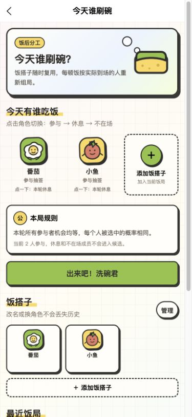

<p align="center">
  
</p>

<h1 align="center">鱼哥菜谱</h1>


> 一个基于公开菜谱数据的跨平台菜谱浏览应用，也提供无需登录的“今天谁刷碗”饭后分工工具。


## 项目简介

鱼哥菜谱使用 uni-app 构建，目标是把散落在 `cook-book/` 中的家常菜谱整理成一个随手可查、照着能做的数字厨房。菜谱数据来自社区项目 [CookLikeHOC 像老乡鸡🐔那样做饭](https://github.com/Gar-b-age/CookLikeHOC)，后端使用 Supabase 提供数据查询和图片存储。

项目同时包含一个本地运行的饭后分工功能：用户可以维护饭搭子、按每顿饭重新组局，并以等概率随机方式决定本轮刷碗人。

## 当前功能

- 首页：搜索入口、每日推荐、菜品分类和“今天谁刷碗”快捷入口。
- 分类菜谱：按分类查看菜谱，显示分类菜谱数量，支持分页加载、下拉刷新和空态/错误态。
- 搜索菜谱：按菜名或食材关键词搜索，保存最近搜索历史，支持分页加载、刷新和清空结果。
- 菜谱详情：封面、分类、食材清单、制作流程图、分步做法、制作小贴士和相关推荐。
- 今天谁刷碗：
  - 在当前设备维护饭搭子，可编辑昵称、角色和主题色；成员可删除、恢复或彻底删除。
  - 每顿饭独立组局，可将成员标记为参与、休息或不在场。
  - 仅从本轮参与者中进行等概率随机，每个人的概率为 `1 / 参与人数`，历史次数不会改变概率。
  - 通过餐盘、泡沫和水花动效揭晓结果，支持跳过动效、换签、洗完打卡和多顿饭历史记录。
- 关于页：显示版本信息、隐私与声明，并提供 GitHub 仓库入口。
- 全局体验：统一的插画风卡片、骨架屏、加载态、空态、错误提示和弹层反馈。
- 分享：首页、分类、搜索、详情和饭后分工页提供对应的平台分享文案；微信小程序饭后分工页支持分享到朋友圈。

### 数据与隐私边界

菜谱内容和公开图片通过 Supabase 读取；饭搭子、饭局、抽签结果和搜索历史只保存在当前设备，不登录、不跨设备同步，也不提供防篡改保证。饭后分工功能不会把成员 ID、饭局 ID 或本地历史写入分享路径。

## 小程序体验

下面是微信小程序码，使用微信扫一扫即可打开体验（具体可用性以小程序当前发布状态为准）。

<p align="center">
  
</p>

## 页面截图

以下截图来自当前 H5 开发环境，使用真实 Supabase 数据生成。由于 H5 截图采用移动端视口，图片会保留接近小程序的窄屏比例。

### 首页


### 分类菜谱


### 菜谱详情


### 今天谁刷碗



## 技术栈

- 应用：uni-app、Vue 3、TypeScript
- UI 与样式：wot-ui、UnoCSS、自定义插画风设计变量
- 状态与请求：Pinia、Alova、VueUse
- 图表/动效：uni-echarts、Lottie（饭后分工揭晓动效）
- 构建：Vite
- 后端：Supabase Postgres、RLS、RPC、Storage

## 支持的平台

仓库已配置 H5、微信小程序以及 uni-app 常见 App/小程序构建目标。实际发布前请按目标平台配置对应的 manifest、开发者工具和环境变量。

## 快速开始

### 1. 环境要求

- Node.js：满足 `package.json` 中的版本要求（推荐 Node.js 20.19+）
- pnpm：`9.9.0`（项目通过 `packageManager` 声明）
- Supabase CLI：执行数据库迁移时需要

### 2. 安装依赖

```bash
pnpm install
```

### 3. 配置环境变量

开发环境通常使用 `.env.development.local`（前端）和 `.env.local`（脚本）。这两个文件已被 `.gitignore` 忽略，不能提交真实密钥。

```dotenv
# 前端请求使用：只放公开 anon key
VITE_SUPABASE_URL=https://<your-project>.supabase.co
VITE_SUPABASE_ANON_KEY=<your-anon-key>

# 数据导入与 Storage 脚本使用：仅在本地脚本环境使用
SUPABASE_URL=https://<your-project>.supabase.co
SUPABASE_SERVICE_KEY=<your-service-role-key>
```

不要把 `SUPABASE_SERVICE_KEY` 写入 `VITE_*` 变量，也不要在前端代码或提交记录中暴露 service role key。

### 4. 初始化 Supabase

先完成 Supabase 项目关联，然后推送 `supabase/migrations/` 中的迁移：

```bash
supabase db push
```

迁移会创建 `recipes` 表、行级安全策略，以及分类查询、分类计数、每日推荐和同分类相关推荐 RPC。

### 5. 导入菜谱与图片

一键执行数据导入、Storage 上传和数据校验（不包含数据库迁移）：

```bash
pnpm run setup:all
```

也可以按需分步执行：

```bash
# 解析 cook-book/ 下的 Markdown 并写入 recipes
pnpm run setup:data

# 上传分类图标、流程图并回写流程图 URL
pnpm run setup:storage

# 检查总数、分类统计、空字段和样本
pnpm run setup:verify
```

如果需要自动化执行完整初始化，可参考 `scripts/init-supabase.ts`，并确保已安装、登录且关联 Supabase CLI。首次配置或排查问题时，建议优先按上面的步骤分开执行并查看具体输出。

### 6. 启动开发环境

```bash
# H5 开发
pnpm dev:h5:development

# 微信小程序开发
pnpm dev:mp-weixin
```

常用构建命令：

```bash
pnpm build:h5
pnpm build:mp-weixin
pnpm build:app-android
pnpm build:app-ios
```

## 数据目录与 Storage

菜谱 Markdown 按目录分类存放在 `cook-book/`。当前仓库包含 14 个菜谱分类、180 份菜谱文档和一个包含 18 份配料文档的 `配料/` 目录；`cook-book/images/` 存放原始菜谱图片、分类图标和手绘流程图。

| Storage 桶 | 本地来源 | 用途 |
| --- | --- | --- |
| `category-icons` | `cook-book/images/cook-category/` | 首页分类快捷入口图标 |
| `process-images` | `cook-book/images/cook-process/` | 菜谱详情制作流程图 |

主要数据库迁移：

- `001_create_recipes_table.sql`：创建 `recipes` 表、索引、RLS 和权限。
- `002_get_unique_categories.sql`：分类查询 RPC。
- `003_get_unique_categories_with_icons.sql`：返回分类及图标 URL。
- `004_count_recipes_by_category.sql`：统计分类菜谱数量。
- `005_get_daily_recommended_recipes.sql`：按日期种子生成每日推荐。
- `006_get_random_recipes_by_category.sql`：获取同分类相关推荐。

## 常用脚本

| 命令 | 用途 |
| --- | --- |
| `pnpm type-check` | TypeScript 类型检查 |
| `pnpm lint` | ESLint 检查 |
| `pnpm smoke:ui` | 页面结构与关键视觉约束冒烟检查 |
| `pnpm verify:dish-duty` | 饭后分工状态、抽签和持久化逻辑校验 |
| `pnpm setup:data` | 导入菜谱数据 |
| `pnpm setup:storage` | 上传分类图标和流程图 |
| `pnpm setup:verify` | 校验数据质量 |

## SDD 与 OpenSpec 开发流程

本项目使用 [OpenSpec](https://github.com/Fission-AI/OpenSpec) 实行 SDD（Spec-Driven Development）。功能、行为、公共接口、数据模型和架构变更必须先形成可评审规格，再进入编码；纯文案、注释和不改变行为的文档维护可以直接修改。

首次参与开发时，请先安装并验证 OpenSpec CLI（要求 Node.js 20.19.0 或更高版本）：

```bash
npm install -g @fission-ai/openspec@1.9.0
openspec --version
```

在 Codex 中使用以下流程：

```text
$openspec-explore              # 可选：梳理模糊需求与现有实现
$openspec-propose "变更描述"   # 生成 proposal/specs/design/tasks
$openspec-apply-change         # 按已确认的规格实施并完成任务
$openspec-verify-change        # 独立核对规格、实现、测试和任务
$openspec-archive-change       # Verify 通过且用户确认后归档
```

常用终端检查：

```bash
openspec list
openspec show <change-name>
openspec validate <change-name> --strict
```

规格文件位于 `openspec/`：

- `openspec/specs/`：已交付行为的事实来源。
- `openspec/changes/`：进行中的提案、增量规格、设计与任务。
- `openspec/changes/archive/`：已完成变更的审计记录。
- `openspec/config.yaml`：项目技术栈、边界、产出规则和验证要求。

## 声明与致谢

- 本项目并非任何商家官方仓库，仅用于学习与技术交流。
- 感谢老乡鸡《老乡鸡菜品溯源报告》公布菜品，让我们能够像老乡鸡一样会做饭。
- 数据与灵感参考了社区项目 [CookLikeHOC](https://github.com/Gar-b-age/CookLikeHOC)。如有问题或建议，欢迎提交 Issue 或 Pull Request。

## 许可

本项目基于 MIT 协议发布，详见 [LICENSE](LICENSE)（如仓库未附带单独文件，则以 `package.json` 中的许可证声明为准）。
